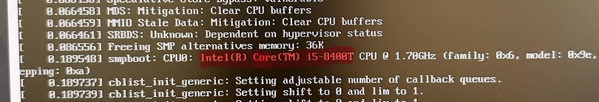

---
## Front matter
lang: ru-RU
title: Презентация по лабораторной работе номер 1
subtitle: Информационная Безопасность
author:
  - Кабанова Варвара Дмитриевна
institute:
  - Российский университет дружбы народов, Москва, Россия
  - Объединённый институт ядерных исследований, Дубна, Россия
date: 04 сентября 2024 года

## i18n babel
babel-lang: russian
babel-otherlangs: english

## Formatting pdf
toc: false
toc-title: Содержание
slide_level: 2
aspectratio: 169
section-titles: true
theme: metropolis
header-includes:
 - \metroset{progressbar=frametitle,sectionpage=progressbar,numbering=fraction}
---

# Вводная часть

## Цель

Целью данной работы является приобретение практических навыков
установки операционной системы на виртуальную машину, настройки ми-
нимально необходимых для дальнейшей работы сервисов.

## Задание

1. Установка и настройка операционной системы.
2. Найти следующую информацию:
	1. Версия ядра Linux (Linux version).
	2. Частота процессора (Detected Mhz processor).
	3. Модель процессора (CPU0).
	4. Объем доступной оперативной памяти (Memory available).
	5. Тип обнаруженного гипервизора (Hypervisor detected).
	6. Тип файловой системы корневого раздела.

# Элементы презентации

## Актуальность

- Даёт понять, о чём пойдёт речь
- Следует широко и кратко описать проблему
- Мотивировать свое исследование
- Сформулировать цели и задачи
- Возможна формулировка ожидаемых результатов

## Выполнение лабораторной работы

Запускаю терминал. Перехожу в каталог /var/tmp. Провожу установку и
конфигурацию операционной системы. Запускаю виртуальную машину. (рис. 1).

{#fig:001 width=70%}

Проверяю в свойствах VirtualBox месторасположение каталога для виртуальных машин. (рис. 2).

{#fig:002 width=70%}

Указываю имя виртуальной машины (мой логин в дисплейном классе), а также тип операционной системы — Linux (рис. 3).

{#fig:003 width=70%}

Выставляю основной памяти размер 2048 Мб, выбираю 1 процессор (рис. 4).

{#fig:004 width=70%}

Выделаю 40 Гб памяти на виртуальном жестком диске (рис. 5).

{#fig:005 width=70%}

Выбираю в VirtualBox «Свойства», затем «Носители» виртуальной машины. Добавляю новый привод оптических дисков.  (рис. 6).

{#fig:006 width=70%}

Запускаю виртуальную машину (рис. 7).

{#fig:007 width=70%}

Выбираю язык установки (рис. 8).

{#fig:008 width=70%}

В обзоре установки будем проверять все настройки и менять на нужные (рис. 9).

{#fig:009 width=70%}

Язык раскладки должен быть русский (рис. 10).

{#fig:010 width=70%}

Часовой пояс поменяла на московское время. Установила пароль для администратора. Для пользователя так же сделала пароль и сделала этого пользователя администратором .

В соответствии с требованием лабораторной работы выбираю окружение сервер с GUB и средства разработки в дополнительном программном обеспечении (рис. 11).

{#fig:011 width=70%}

Отключаю kdump (рис. 12).

{#fig:012 width=70%}

Проверяю сеть, указываю имя узла в соответствии с соглашением об именовании (рис. 13).

{#fig:013 width=70%}

Начало установки (рис. 14).

{#fig:014 width=70%}

После заврешения установки образ диска сам пропадет из носителей. После установки при запуске операционной системы появляется окно выбора пользователя.

## Выполнение дополнительного задания

Открываю терминал, в нем прописываю dmesg | less (рис. 15).

{#fig:015 width=70%}

Версия ядра 5.14.0-284.11.1.el9_2.x86_64 (рис. 16).

{#fig:016 width=70%}

Частота процессора 1704 МГц (рис. 17).

{#fig:017 width=70%}

Модель процессора Intel Core i5-8400T (рис. 18).

{#fig:018 width=70%}

Доступно 213688 Кб из 2096696 Кб (рис. 19).

{#fig:019 width=70%}

Обнаруженный гипервизор типа KVM (рис. 20).

{#fig:020 width=70%}

sudo fdish -l показывает тип файловой системы, типа Linux, Linux LVM (рис. 21).

{#fig:021 width=70%}

Далее показана последовательно монтирования файловых систем (рис. 22).

{#fig:022 width=70%}

## Вывод

Я приобрела практические навыки
установки операционной системы на виртуальную машину, настройки ми-
нимально необходимых для дальнейшей работы сервисов.

:::

