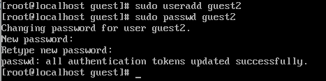
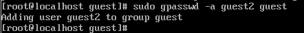
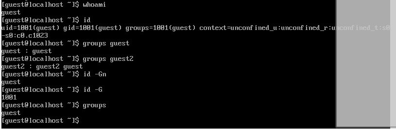
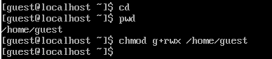
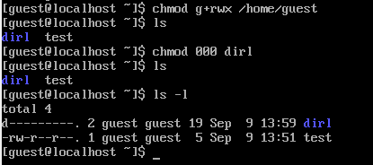

---
## Front matter
lang: ru-RU
title: Презентация по лабораторной работе номер 3
subtitle: Информационная Безопасность
author:
  - Кабанова Варвара Дмитриевна
institute:
  - Российский университет дружбы народов, Москва, Россия
  - Объединённый институт ядерных исследований, Дубна, Россия
date: 16 сентября 2024 года

## i18n babel
babel-lang: russian
babel-otherlangs: english

## Formatting pdf
toc: false
toc-title: Содержание
slide_level: 2
aspectratio: 169
section-titles: true
theme: metropolis
header-includes:
 - \metroset{progressbar=frametitle,sectionpage=progressbar,numbering=fraction}
---

# Вводная часть
# Цель работы

Получить практические навыки работы в консоли с атрибутами файлов для групп пользователей.

# Задание

1. Создание пользователя guest2, добавление его в группу пользователей guest
2. Заполнение таблицы 3.1
3. Заполнение таблицы 3.2 на основе таблицы 3.1.

# Выполнение лабораторной работы

1. Пользователь guest был создан в лабораторной работе №2, поэтому в этой лабораторной работе его не создаем заново
2. Пароль для пользователя guest тоже был задан в лабораторной работе №2. 
3. С правами администратора создаю пользователя guest с помощью команды `useradd`, далее с помощью команды `passwd` задаю пароль пользователю (рис. 1).

{#fig:001 width=70%}

4. Добавляю пользователя guest2 в группу guest (рис. 2).

{#fig:002 width=70%}

5. Зашла на двух разных консолях от имени двух разных пользователей с помощью команды `su <имя пользователя>` (рис. 3).

{#fig:003 width=70%}

6. Проверяю путь директории, в которой я нахожусь с помощью `pwd`.

Проверка для пользователя guest (рис. 4).

{#fig:004 width=70%}

Проверка для пользователя guest2 (рис. 5).

{#fig:005 width=70%}

Стоит отметить, что вход в терминал от имени пользователей был выполнен в домашней директории пользователя evdvorkina, которую команда `pwd` вывела. Домашней директорией пользователей она не является. Текущая директория с приглашением командной строки совпадает.

7. Проверяю имя пользователей с поомощью команды whoami, с помощью команды id могу увидеть группы, к которым принадлежит пользователь и коды этих групп (gid), команда groups просто выведет список групп, в которые входит пользователь.

id -Gn - выведет названия групп, которым принадлежит пользователь

id -G - выведет только код групп, которым принадлежит пользователь. 

Проверка для пользователя guest2 (рис. 6).

{#fig:006 width=70%}

Проверка для пользователя guest (рис. 7).

{#fig:007 width=70%}

Пользователь guest2 входит в две группы пользователей: в группу guest, потому что я сама его туда добавила, и в группу guest2, которая создалась автоматически при создании пользователя.

8. Вывела интересующее меня содержимое файла etc/group, видно, что в группе guest два пользователя, а в группе guest2 один (рис. 8).

{#fig:008 width=70%}

9. От имени пользователя guest2 регистрирую его в группе guest с помощью команды `newgrp` (рис. 9).

{#fig:009 width=70%}

10. Добавляю права на чтение, запись и исполнение группе пользвателей guest (guest, guest2) на директорию home/guest в которой находятся все файлы для последующей работы (рис. 10).

{#fig:010 width=70%}

11. От имени пользователя guest снимаю все атрибуты с директории dir1, созданной в предыдущей лабораторной работе. Проверяю, что права действительно сняты (рис. 11). 

{#fig:011 width=70%}

# Выводы

Были получены практические навыки работы в консоли с атрибутами файлов для групп пользователей

# Список литературы. Библиография

[0] Методические материалы курса

[1] Права доступа: https://codechick.io/tutorials/unix-linux/unix-linux-permissions

[2] Группы пользователей: https://losst.pro/gruppy-polzovatelej-linux#Что_такое_группы
