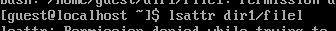
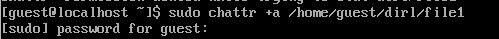
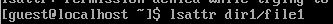
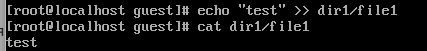
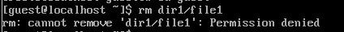
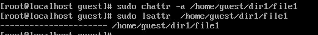
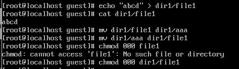
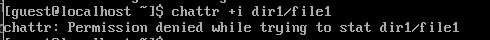
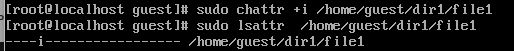
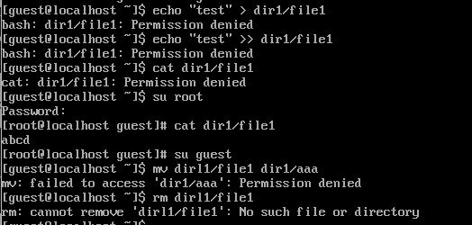

---
## Front matter
title: "Отчет по лабораторной работе №4"
subtitle: "Основы информационной безопасности"
author: "Кабанова Варвара, НПМбд02-21"

## Generic otions
lang: ru-RU
toc-title: "Содержание"

## Bibliography
bibliography: bib/cite.bib
csl: pandoc/csl/gost-r-7-0-5-2008-numeric.csl

## Pdf output format
toc: true # Table of contents
toc-depth: 2
lof: true # List of figures
lot: true # List of tables
fontsize: 12pt
linestretch: 1.5
papersize: a4
documentclass: scrreprt
## I18n polyglossia
polyglossia-lang:
  name: russian
  options:
	- spelling=modern
	- babelshorthands=true
polyglossia-otherlangs:
  name: english
## I18n babel
babel-lang: russian
babel-otherlangs: english
## Fonts
mainfont: PT Serif
romanfont: PT Serif
sansfont: PT Sans
monofont: PT Mono
mainfontoptions: Ligatures=TeX
romanfontoptions: Ligatures=TeX
sansfontoptions: Ligatures=TeX,Scale=MatchLowercase
monofontoptions: Scale=MatchLowercase,Scale=0.9
## Biblatex
biblatex: true
biblio-style: "gost-numeric"
biblatexoptions:
  - parentracker=true
  - backend=biber
  - hyperref=auto
  - language=auto
  - autolang=other*
  - citestyle=gost-numeric
## Pandoc-crossref LaTeX customization
figureTitle: "Рис."
tableTitle: "Таблица"
listingTitle: "Листинг"
lofTitle: "Список иллюстраций"
lotTitle: "Список таблиц"
lolTitle: "Листинги"
## Misc options
indent: true
header-includes:
  - \usepackage{indentfirst}
  - \usepackage{float} # keep figures where there are in the text
  - \floatplacement{figure}{H} # keep figures where there are in the text
---

# Цель работы

Получение практических навыков работы в консоли с расширенными
атрибутами файлов

# Теоретическое введение

**Права доступа** определяют, какие действия конкретный пользователь может или не может совершать с определенным файлами и каталогами. С помощью разрешений можно создать надежную среду — такую, в которой никто не может поменять содержимое ваших документов или повредить системные файлы. [1]

**Расширенные атрибуты файлов Linux** представляют собой пары имя:значение, которые постоянно связаны с файлами и каталогами, подобно тому как строки окружения связаны с процессом. Атрибут может быть определён или не определён. Если он определён, то его значение может быть или пустым, или не пустым. [2]

Расширенные атрибуты дополняют обычные атрибуты, которые связаны со всеми inode в файловой системе (т. е., данные stat(2)). Часто они используются для предоставления дополнительных возможностей файловой системы, например, дополнительные возможности безопасности, такие как списки контроля доступа (ACL), могут быть реализованы через расширенные атрибуты. [3]

*Установить атрибуты:*

- chattr filename

*Значения:*

- chattr +a # только добавление. Удаление и переименование запрещено;

- chattr +A # не фиксировать данные об обращении к файлу

- chattr +c # сжатый файл

- chattr +d # неархивируемый файл

- chattr +i # неизменяемый файл

- chattr +S # синхронное обновление

- chattr +s # безопасное удаление, (после удаления место на диске переписывается нулями)

- chattr +u # неудаляемый файл

- chattr -R # рекурсия

*Просмотреть атрибуты:*

- lsattr filename

*Опции:*

- lsattr -R # рекурсия

- lsattr -a # вывести все файлы (включая скрытые)

- lsattr -d # не выводить содержимое директории

# Выполнение лабораторной работы

1. От имени пользователя guest, созданного в прошлых лабораторных работах, определяю расширенные атрибуты файлa `/home/guest/dir1/file1` (рис. 1).

{#fig:001 width=70%}

2. Изменяю права доступа для файла home/guest/dir1/file1 с помощью chmod 600 (рис. 2).

{#fig:002 width=70%}

3. Пробую установить на файл /home/guest/dir1/file1 расширен-
ный атрибут a от имени пользователя guest, в ответ получаю отказ от выполнения операции (рис. 3).

{#fig:003 width=70%}

4. Устанавливаю расширенные права уже от имени суперпользователя, теперь нет отказа от выполнения операции (рис. 4).

{#fig:004 width=70%}

5. От пользователя guest проверяю правильность установки атрибута (рис. 5).

{#fig:005 width=70%}

6. Выполняю **дозапись** в файл с помощью `echo 'test' >> dir1/file1`, далее выполняю чтение файла, убеждаюсь, что дозапись была выполнена (рис. 6).

{#fig:006 width=70%}

7. Пробую удалить файл, получаю отказ от выполнения действия.  (рис. 7).

{#fig:007 width=70%}

То же самое получаю при попытке переименовать файл(рис. 8).

{#fig:008 width=70%}

8. Получаю отказ от выполнения при попытке установить другие права доступа (рис. 9).

{#fig:009 width=70%}

9. Снимаю расширенные атрибуты с файла (рис. 10).

{#fig:010 width=70%}

Проверяю ранее не удавшиеся действия: чтение, переименование, изменение прав доступа. Теперь все из этого выполняется (рис. 11).

{#fig:011 width=70%}

10. Пытаюсь добавить расширенный атрибут i от имени пользователя guest, как и раньше, получаю отказ (рис. 12).

{#fig:012 width=70%}

Добавляю расширенный атрибут i от имени суперпользователя, теперь все выполнено верно (рис. 13).

{#fig:013 width=70%}

Пытаюсь записать в файл, дозаписать, переименовать или удалить, ничего из этого сделать нельзя (рис. 14).

{#fig:014 width=70%}

# Выводы

В результате выполнения работы вы повысили свои навыки использования интерфейса командой строки (CLI), познакомились на примерах с тем,
как используются основные и расширенные атрибуты при разграничении
доступа. Имели возможность связать теорию дискреционного разделения
доступа (дискреционная политика безопасности) с её реализацией на практике в ОС Linux. Опробовали действие на практике расширенных атрибутов «а» и «i»

# Список литературы. Библиография

[0] Методические материалы курса

[1] Права доступа: https://codechick.io/tutorials/unix-linux/unix-linux-permissions

[2] Расширенные атрибуты: https://ru.manpages.org/xattr/7

[3] Операции с расширенными атрибутами: https://p-n-z-8-8.livejournal.com/64493.html
