---
## Front matter
lang: ru-RU
title: Лабораторная работа 6
subtitle: Информационная безопасность
author:
  - Кабанова В.Д
institute:
  - Российский университет дружбы народов, Москва, Россия
date: 30 сентября 2024

## i18n babel
babel-lang: russian
babel-otherlangs: english

## Formatting pdf
toc: false
toc-title: Содержание
slide_level: 2
aspectratio: 169
section-titles: true
theme: metropolis
header-includes:
 - \metroset{progressbar=frametitle,sectionpage=progressbar,numbering=fraction}
---

# Выполнение лабораторной работы

Вошла в систему под своей учетной записью. Убедилась, что SELinux работает в режиме enforcing политики targeted с помощью команд getenforce и sestatus (рис. [-@fig:001]).

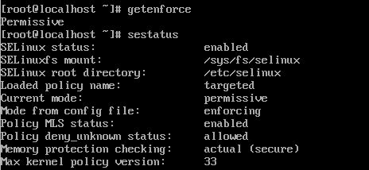{#fig:001 width=70%}

Запускаю сервер apache, далее обращаюсь с помощью браузера к веб-серверу, запущенному на компьютере, он работает, что видно из вывода команды `service httpd status` (рис. 2-5).

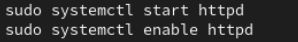{#fig:002 width=70%}

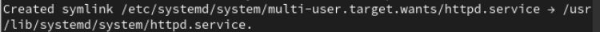{#fig:003 width=70%}

{#fig:004 width=70%}

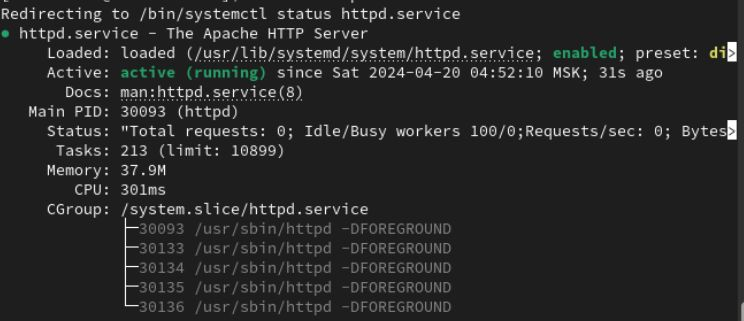{#fig:005 width=70%}

С помощью команды `ps auxZ | grep httpd` нашла веб-сервер Apache в списке процессов. Его контекст
безопасности - httpd_t (рис.6-7 ).

{#fig:006 width=70%}

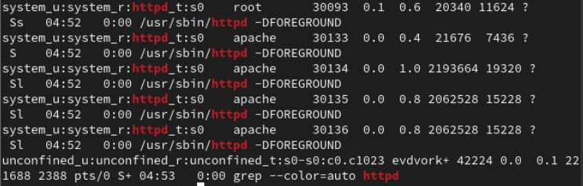{#fig:007 width=70%}

Просмотрела текущее состояние переключателей SELinux для Apache с помощью команды `sestatus -bigrep httpd` (рис. 8-9).

{#fig:004 width=70%}

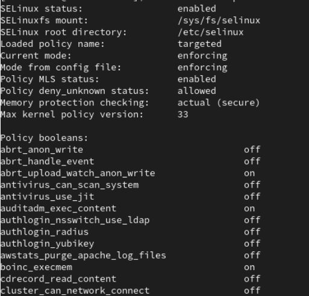{#fig:004 width=70%}

Просмотрела статистику по политике с помощью команды `seinfo`. Множество пользователей - 8, ролей - 39, типов - 5135. (рис. 10).

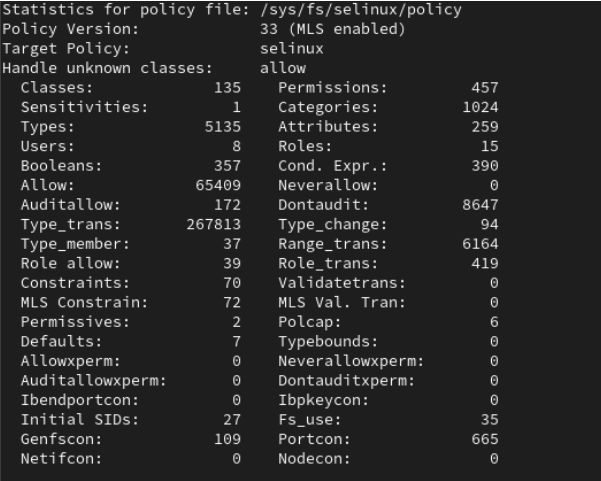{#fig:010 width=70%}

Типы поддиректорий, находящихся в директории `/var/www`, с помощью команды `ls -lZ /var/www` следующие: владелец - root, права на изменения только у владельца. Файлов в директории нет (рис.11-12).

{#fig:011 width=70%}

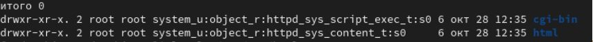{#fig:012 width=70%}

В директории `/var/www/html` нет файлов. (рис. 13).

{#fig:013 width=70%}

Создать файл может только суперпользователь, поэтому от его имени создаем файл touch.html cо следующим содержанием:
```html
<html>
<body>test</body>
</html>
```
(рис. 14-15).

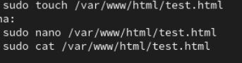{#fig:014 width=70%}

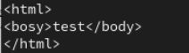{#fig:015 width=70%}

Проверяю контекст созданного файла. По умолчанию это httpd_sys_content_t (рис. 16-17).

{#fig:016 width=70%}

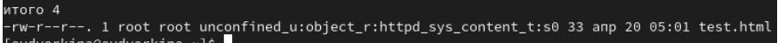{#fig:017 width=70%}

Обращаюсь к файлу через веб-сервер, введя в браузере адрес http://127.0.0.1/test.html. Файл был успешно отображён (рис. 18).

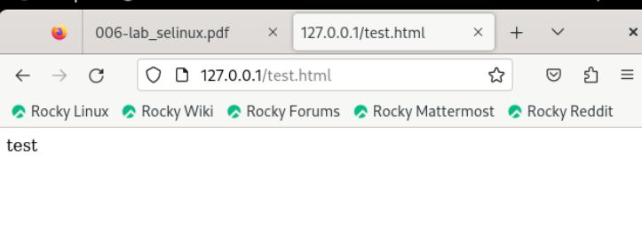{#fig:018 width=70%}

Изучила справку man httpd_selinux.
Рассмотрим полученный контекст детально. Так как по умолчанию пользователи CentOS являются свободными от типа
(unconfined в переводе с англ. означает свободный), созданному нами
файлу test.html был сопоставлен SELinux, пользователь unconfined_u.
Это первая часть контекста.
Далее политика ролевого разделения доступа RBAC используется процессами, но не файлами, поэтому роли не имеют никакого значения для
файлов. Роль object_r используется по умолчанию для файлов на «постоянных» носителях и на сетевых файловых системах. (В директории
/ргос файлы, относящиеся к процессам, могут иметь роль system_r.
Если активна политика MLS, то могут использоваться и другие роли,
например, secadm_r. Данный случай мы рассматривать не будем, как и
предназначение :s0).
Тип httpd_sys_content_t позволяет процессу httpd получить доступ к файлу. Благодаря наличию последнего типа мы получили доступ к файлу
при обращении к нему через браузер. (рис. 19).

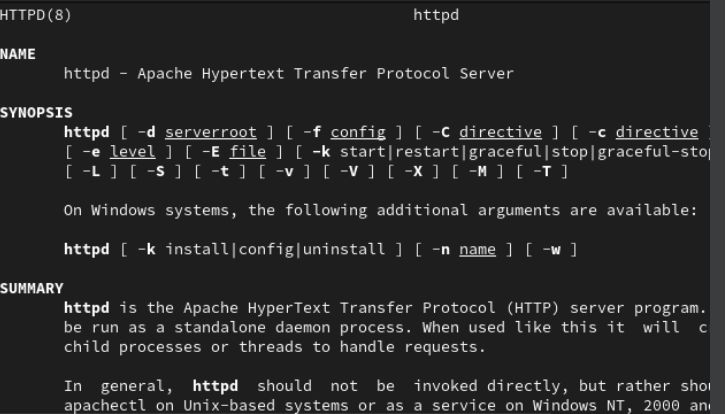{#fig:019 width=70%}

Изменяю контекст файла `/var/www/html/test.html` с
`httpd_sys_content_t` на любой другой, к которому процесс httpd не
должен иметь доступа, например, `на samba_share_t`:
`chcon -t samba_share_t /var/www/html/test.html`
`ls -Z /var/www/html/test.html`
Контекст действительно поменялся (рис. 20-21).

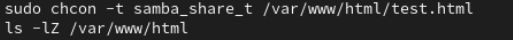{#fig:020 width=70%}

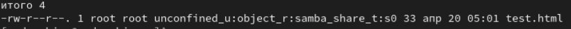{#fig:021 width=70%}

При попытке отображения файла в браузере получаем сообщение об ошибке (рис. 22).

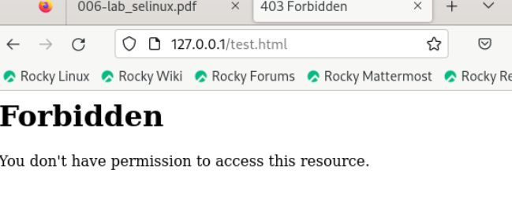{#fig:022 width=70%}

файл не был отображён, хотя права
доступа позволяют читать этот файл любому пользователю, потому что установлен контекст, к которому процесс httpd не должен иметь доступа.

Просматриваю log-файлы веб-сервера Apache и системный лог-файл:
`tail /var/log/messages`. Если в системе окажутся запущенными процессы setroubleshootd и
audtd, то вы также сможете увидеть ошибки, аналогичные указанным
выше, в файле /var/log/audit/audit.log. (рис. 23-26).

{#fig:023 width=70%}

{#fig:023 width=70%}

{#fig:023 width=70%}

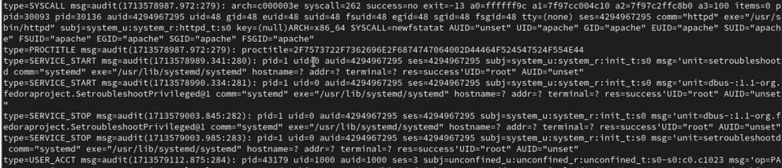{#fig:023 width=70%}

Чтобы запустить веб-сервер Apache на прослушивание ТСР-порта
81 (а не 80, как рекомендует IANA и прописано в /etc/services) открываю файл /etc/httpd/httpd.conf для изменения. (рис. 27).

{#fig:027 width=70%}

Нахожу строчку Listen 80 и
заменяю её на Listen 81.  (рис. 28).

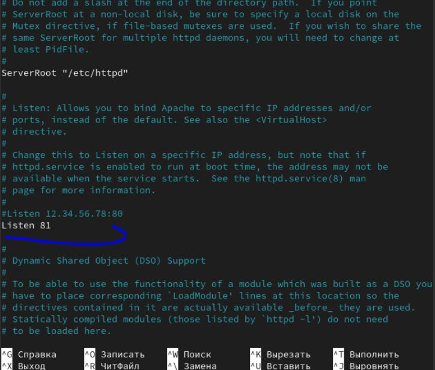{#fig:028 width=70%}

Выполняю перезапуск веб-сервера Apache. Произошёл сбой, потому что порт 80 для локальной сети, а 81 нет (рис. 29).

{#fig:029 width=70%}

Проанализируйте лог-файлы:
`tail -nl /var/log/messages`
 (рис. 30).

{#fig:030 width=70%}

Просмотрите файлы `/var/log/http/error_log`,
`/var/log/http/access_log` и `/var/log/audit/audit.log` и
выясните, в каких файлах появились записи. Запись появилась в файлу error_log (рис. 31-32).

{#fig:031 width=70%}

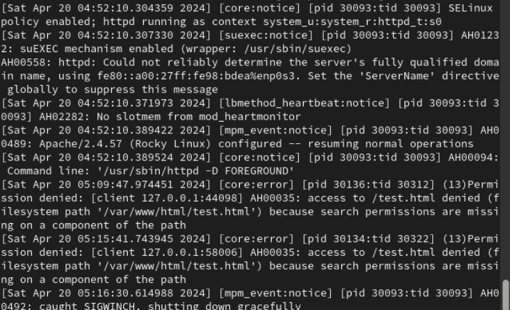{#fig:032 width=70%}

Выполняю команду
`semanage port -a -t http_port_t -р tcp 81`
После этого проверяю список портов командой
`semanage port -l | grep http_port_t`
Порт 81 появился в списке (рис. 33-34).

{#fig:033 width=70%}

{#fig:033 width=70%}

Перезапускаю сервер Apache (рис. 35).

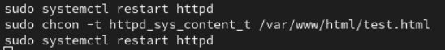{#fig:035 width=70%}

Теперь он работает, ведь мы внесли порт 81 в список портов `htttpd_port_t` (рис. 36).

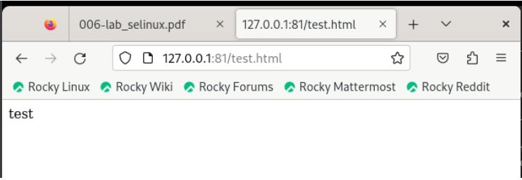{#fig:036 width=70%}

Возвращаю в файле /etc/httpd/httpd.conf порт 80, вместо 81. Проверяю, что порт 81 удален, это правда. (рис. 37-40).

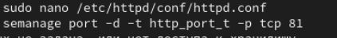{#fig:037 width=70%}

{#fig:038 width=70%}

{#fig:039 width=70%}

{#fig:040 width=70%}

Далее удаляю файл test.html, проверяю, что он удален(рис. 41-42).

{#fig:041 width=70%}

{#fig:042 width=70%}

# Выводы

В ходе выполнения данной лабораторной работы были развиты навыки администрирования ОС Linux, получено первое практическое знакомство с технологией SELinux и проверена работа SELinux на практике совместно с веб-сервером
Apache.