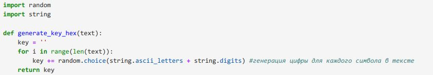
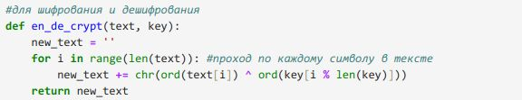
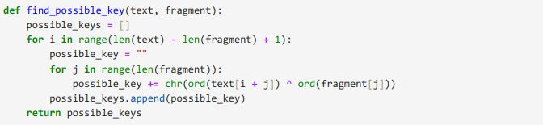
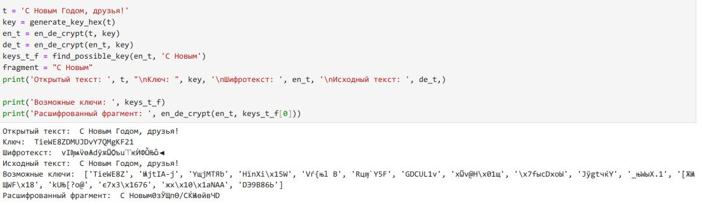

---
## Front matter
lang: ru-RU
title: Лабораторная работа 7
subtitle: Информационная безопасность
author:
  - Кабанова В.Д.
institute:
  - Российский университет дружбы народов, Москва, Россия
date: 30 сентября 2024

## i18n babel
babel-lang: russian
babel-otherlangs: english

## Formatting pdf
toc: false
toc-title: Содержание
slide_level: 2
aspectratio: 169
section-titles: true
theme: metropolis
header-includes:
 - \metroset{progressbar=frametitle,sectionpage=progressbar,numbering=fraction}
---

# Задание

Нужно подобрать ключ, чтобы получить сообщение «С Новым Годом,
друзья!». Требуется разработать приложение, позволяющее шифровать и
дешифровать данные в режиме однократного гаммирования. Приложение
должно:
1. Определить вид шифротекста при известном ключе и известном открытом тексте.
2. Определить ключ, с помощью которого шифротекст может быть преобразован в некоторый фрагмент текста, представляющий собой один из возможных вариантов прочтения открытого текста

# Выполнение лабораторной работы

Я выполнала лабораторную работа на языке программирования Python, листинг программы и результаты выполнения приведены в отчете.

Требуется разработать программу, позволяющее шифровать и дешифровать данные в режиме однократного гаммирования. Начнем с создания функции для генерации случайного ключа (рис. 1).

{#fig:001 width=70%}

Необходимо определить вид шифротекста при известном ключе и известном открытом тексте. Так как операция исключающего или отменяет сама себя, делаю одну функцю и для шифрования и для дешифрования текста (рис. 2).

{#fig:002 width=70%}

Нужно определить ключ, с помощью которого шифротекст может быть преобразован в некоторый фрагмент текста, представляющий собой один из возможных вариантов прочтения открытого текста. Для этого создаю функцию для нахождения возможных ключей для фрагмента текста (рис. 3). 

{#fig:003 width=70%}

Проверка работы всех функций. Шифрование и дешифрование происходит верно, как и нахождение ключей, с помощью которых можно расшифровать верно только кусок текста (рис. 4).

{#fig:004 width=70%}

# Выводы

В ходе выполнения данной лабораторной работы мной было освоено на практике применение режима однократного гаммирования.