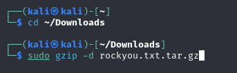
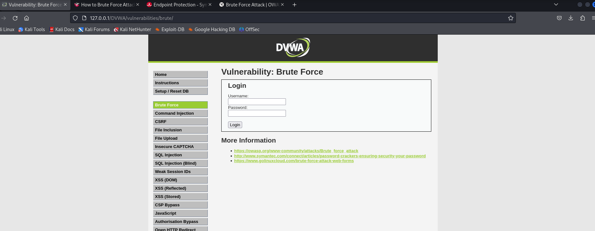
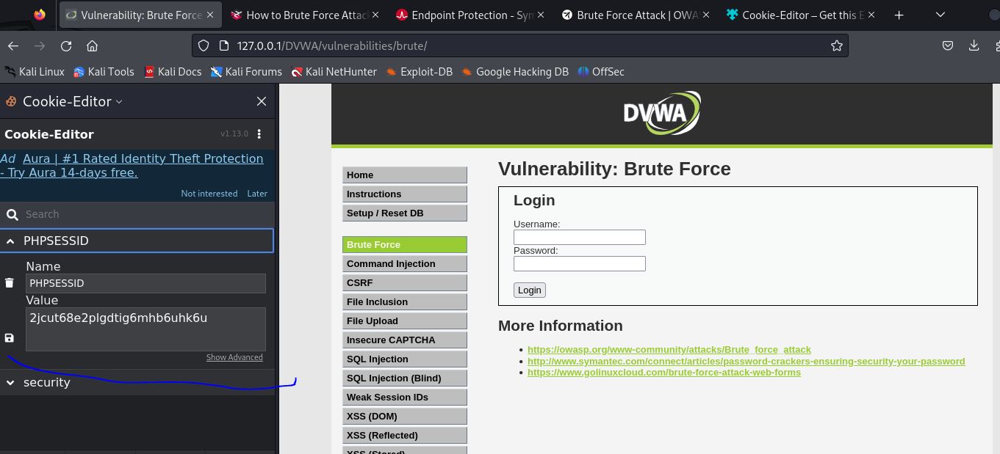
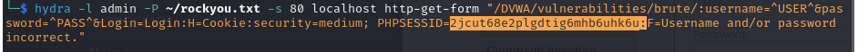
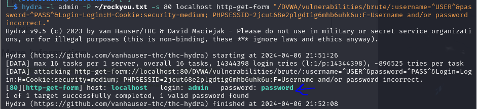
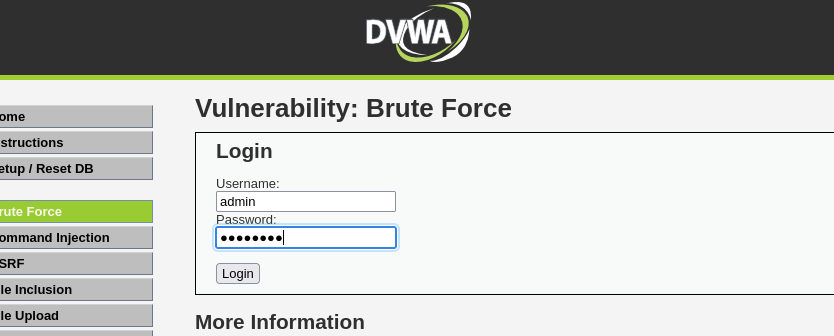
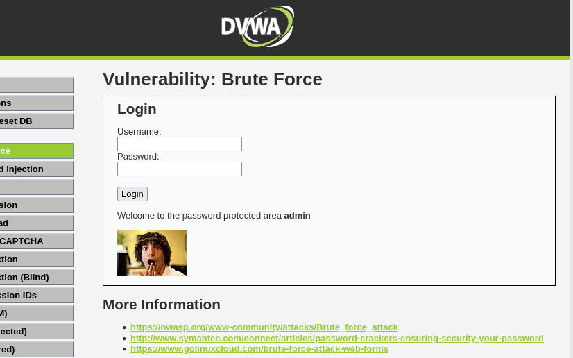

---
## Front matter
lang: ru-RU
title: Презентация по 3 этапу индивидуального проекта
subtitle: Информационная Безопасность
author:
  - Кабанова Варвара Дмитриевна
institute:
  - Российский университет дружбы народов, Москва, Россия
  - Объединённый институт ядерных исследований, Дубна, Россия
date: 23 сентября 2024 года

## i18n babel
babel-lang: russian
babel-otherlangs: english

## Formatting pdf
toc: false
toc-title: Содержание
slide_level: 2
aspectratio: 169
section-titles: true
theme: metropolis
header-includes:
 - \metroset{progressbar=frametitle,sectionpage=progressbar,numbering=fraction}
---

# Цель работы

Приобретение практических навыков по использованию инструмента Hydra для брутфорса паролей.

# Задание

1. Реализовать эксплуатацию уязвимости с помощью брутфорса паролей.

# Теоретическое введение

- Hydra используется для подбора или взлома имени пользователя и пароля.
- Поддерживает подбор для большого набора приложений [@brute, @force, @parasram].

**Пример работы**:

Исходные данные:

- IP сервера 178.72.90.181;

- Сервис http на стандартном 80 порту;

- Для авторизации используется html форма, которая отправляет по адресу http://178.72.90.181/cgi-bin/luci методом POST запрос вида username=root&password=test_password;

- В случае неудачной аутентификации пользователь наблюдает сообщение Invalid username and/or password! Please try again.

- Запрос к Hydra будет выглядеть примерно так:

`hydra -l root -P ~/pass_lists/dedik_passes.txt -o ./hydra_result.log -f -V -s 80 178.72.90.181 http-post-form "/cgi-bin/luci:username=^USER^&password=^PASS^:Invalid username"`

- Используется http-post-form потому, что авторизация происходит по http методом post.

- После указания этого модуля идёт строка /cgi-bin/luci:username=^USER^&password=^PASS^:Invalid username, у которой через двоеточие (:) указывается:

- путь до скрипта, который обрабатывает процесс аутентификации (/cgi-bin/luci);

- строка, которая передаётся методом POST, в которой логин и пароль заменены на ^USER^ и ^PASS^ соответственно (username=^USER^&password=^PASS^);

- строка, которая присутствует на странице при неудачной аутентификации; при её отсутствии Hydra поймёт, что мы успешно вошли (Invalid username).

# Выполнение лабораторной работы

 Чтобы пробрутфорсить пароль, нужно сначала найти большой список частоиспользуемых паролей. Его можно найти в открытых источниках, я взяла стандартный список паролей `rockyou.txt` для kali linux (рис. 1).

{#fig:001 width=70%}

Захожу на сайт DVWA, полученный в ходе предыдущего этапа проекта. Для запроса hydra мне понадобятся параметры cookie с этого сайта (рис. 2).
 
{#fig:002 width=70%}

Чтобы получить информацию о параметрах cookie я установила соответствующее расширение для браузера [@cookies], теперь могу не только увидеть параметры cookie, но и скопировать их (рис. 3).

{#fig:003 width=70%}

Ввожу в Hydra запрос нужную информацию. Пароль будем подбирать для пользователя admin, используем GET-запрос с двумя параметрами cookie: безопасность и PHPSESSID, найденными в прошлом пункте (рис. 4).

{#fig:004 width=70%}

Спустя некоторое время в результат запроса появится результат с подходящим паролем (рис. 5).

{#fig:005 width=70%}

Вводим полученные данные на сайт для проверки (рис. 6).

{#fig:006 width=70%}

Получаем положительный результат проверки пароля. Все сделано верно (рис. 7).

{#fig:007 width=70%}

# Выводы

Приобрела практические навыки по использованию инструмента Hydra для брутфорса паролей
