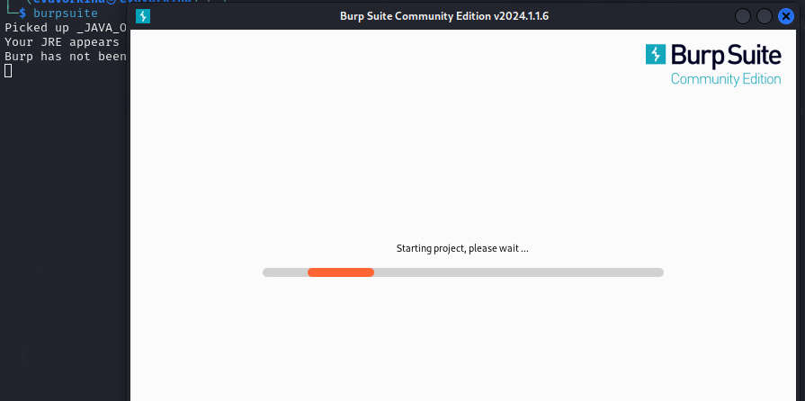
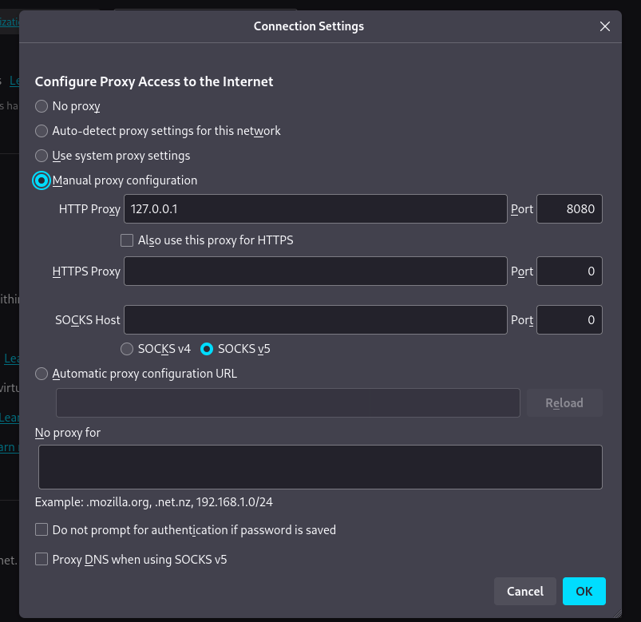
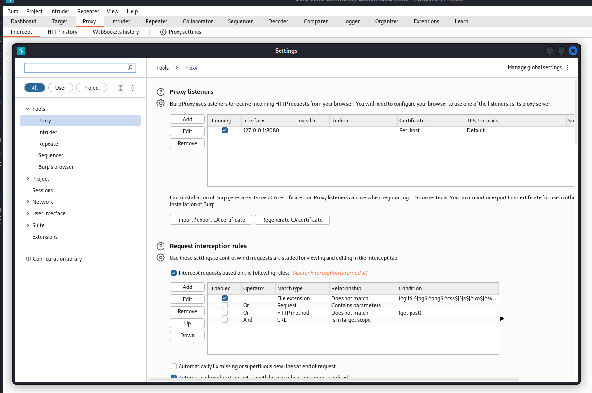
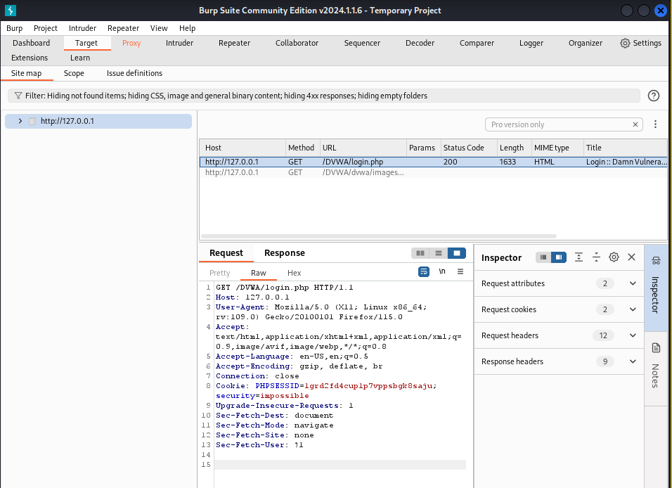
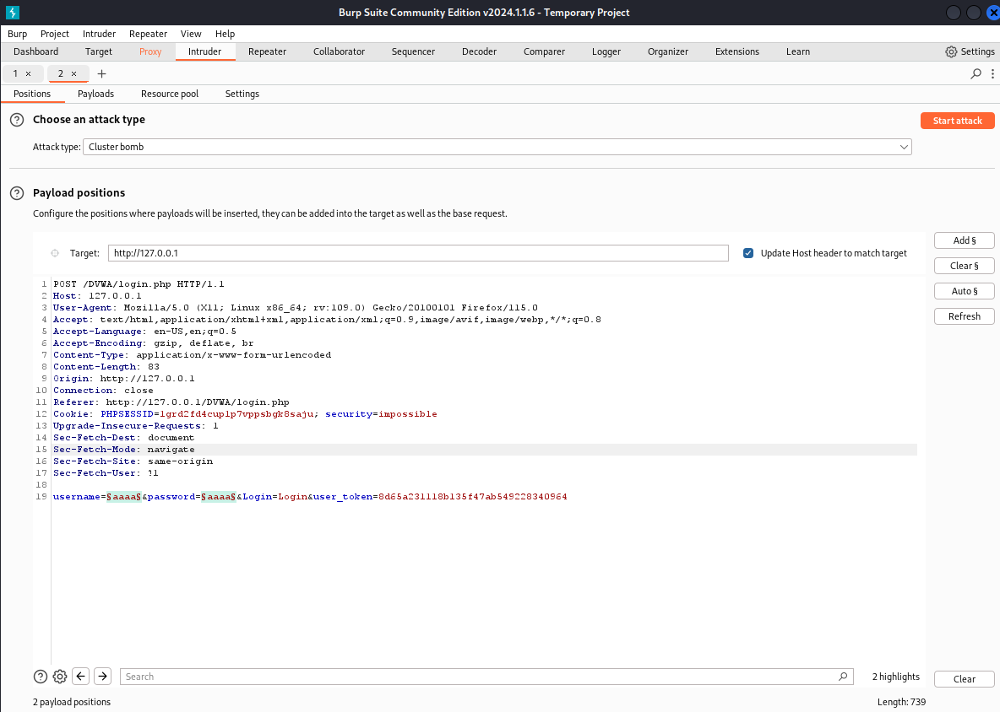
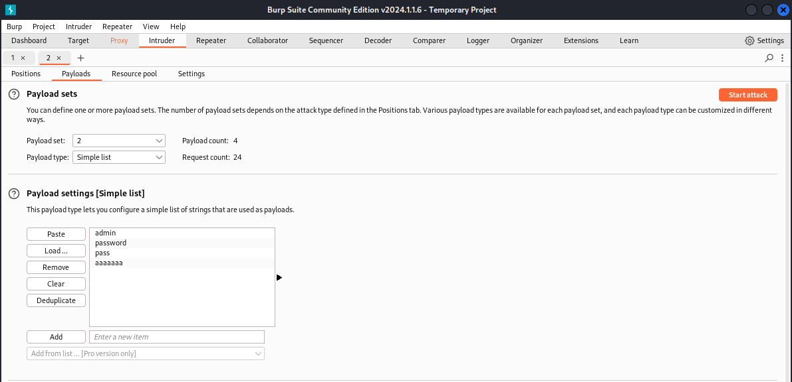
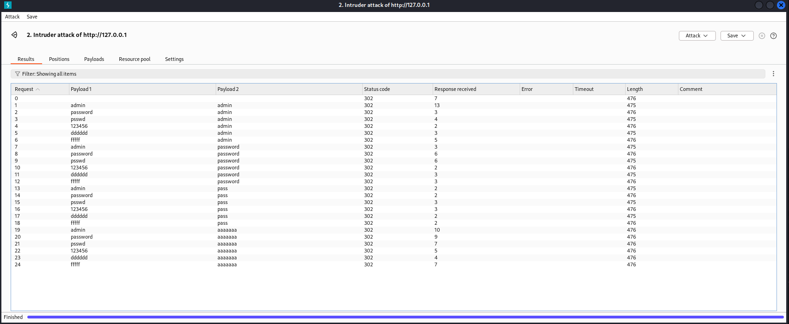
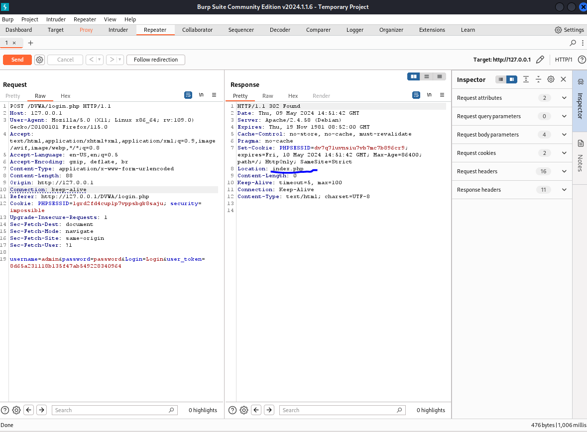
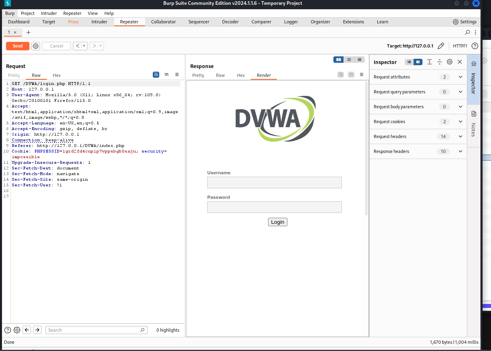

---
## Front matter
lang: ru-RU
title: Презентация по 5 этапу индивидуального проекта
subtitle: Информационная Безопасность
author:
  - Кабанова Варвара Дмитриевна
institute:
  - Российский университет дружбы народов, Москва, Россия
  - Объединённый институт ядерных исследований, Дубна, Россия
date: 23 сентября 2024 года

## i18n babel
babel-lang: russian
babel-otherlangs: english

## Formatting pdf
toc: false
toc-title: Содержание
slide_level: 2
aspectratio: 169
section-titles: true
theme: metropolis
header-includes:
 - \metroset{progressbar=frametitle,sectionpage=progressbar,numbering=fraction}
---

# Цель работы

Научиться использовать Burp Suite.

# Теоретическое введение

Burp Suite представляет собой набор мощных инструментов безопасности веб-приложений, которые демонстрируют реальные возможности злоумышленника,
проникающего в веб-приложения. Эти инструменты позволяют сканировать,
анализировать и использовать веб-приложения с помощью ручных и автоматических методов. Интеграция интерфейсов этих инструментов обеспечивает полную
платформу атаки для обмена информацией между одним или несколькими инструментами, что делает Burp Suite очень эффективной и простой в использовании
платформой для атаки веб-приложений. [@parasram].

# Выполнение лабораторной работы

Запускаю локальный сервер, на котором открою веб-приложение DVWA для тестирования инструмента Burp Suite (рис. [-@fig:001]).

{#fig:001 width=70%}

Запускаю инструмент Burp Suite (рис. [-@fig:002]).

{#fig:002 width=70%}

Открываю сетевые настройки браузера, для подготовке к работе (рис. [-@fig:003]).

{#fig:003 width=70%}

Изменение настроек сервера для работы с proxy и захватом данных с помощью Burp Suite (рис. [-@fig:004]).

{#fig:004 width=70%}

Изменяю настройки Proxy инструмента Burp Suite для дальнейшей работы (рис. [-@fig:005]).

{#fig:005 width=70%}

Во вкладке Proxy устанавливаю "Intercept is on" (рис. [-@fig:006]).

{#fig:006 width=70%}

Чтобы Burp Suite исправно работал с локальным сервером, наобходимо установить параметр `network_allow_hijacking_loacalhost` на `true` (рис. [-@fig:007]).

{#fig:007 width=70%}

Пытаюсь зайти в браузере на DVWA, тут же во вкладки Proxy появляется захваченный запрос. Нажимаем "Forward", чтобы загрузить страницу (рис. [-@fig:008]).

{#fig:008 width=70%}

Загрузилась страница авторизации, текст запроса поменялся (рис. [-@fig:009]).

{#fig:009 width=70%}

История запросов хранится во вкладке Target (рис. [-@fig:010]).

{#fig:010 width=70%}

Попробуем ввести неправильные, случайные данные в веб-приложении и нажмем `Login`. В запросе увидим строку, в которой отображаются введенные нами данные, то есть поле для ввода (рис. [-@fig:011]).

{#fig:011 width=70%}

Этот запрос так же можно найти во вкладке Target, там же жмем правой кнопкой мыши на хост нужного запроса, и далее нажимаем "Send to Intruder" (рис. [-@fig:012]).

{#fig:012 width=70%}

Попадаем на вкладку Intruder, видим значения по умолчанию у типа атаки и наш запрос (рис. [-@fig:013]).

{#fig:013 width=70%}

Изменяем значение типа атаки на Cluster bomb и проставляем специальные символы у тех данных в форме для ввода, которые будем пробивать, то есть у имени пользователя и пароля (рис. [-@fig:014]).

{#fig:014 width=70%}

Так как мы отметили два параметра для подбора, то нам нужно два списка со значениями для подбора. Заполняем первый список в `Payload setting` (рис. [-@fig:015]).

{#fig:015 width=70%}

Переключаемся на второй список и добавляем значения в него. В строке request count видим нужное количество запросов, чтобы проверить все возможные пары пользователь-пароль (рис. [-@fig:016]).

{#fig:016 width=70%}

Запускаю атаку и начинаю подбор (рис. [-@fig:017]).

{#fig:017 width=70%}

При открытии результата каждого post-запроса можно увидеть полученный get-запрос, в нем видно, куда нас перенаправило после выполнения ввода пары пользователь-пароль. В представленном случае с подбором пары admin-admin нас перенаправило на login.php, это значит, что пара не подходит (рис. [-@fig:018]).

{#fig:018 width=70%}

Проверим результат пары admin-password во вкладке Response, теперь нас перенаправляет на страницу index.php, значит пара должна быть верной (рис. [-@fig:019]).

{#fig:019 width=70%}

Дополнительная проверка с использованием Repeater, нажимаем на нужный нам запрос правой кнопкой мыши и жмем "Send to Repeater" (рис. [-@fig:020]).

{#fig:020 width=70%}

Переходим во вкладку "Repeater" (рис. [-@fig:021]).

{#fig:021 width=70%}

Нажимаем "send", получаем в Response в результат перенаправление на index.php (рис. [-@fig:022]).

{#fig:022 width=70%}

После нажатия на `Follow redirection`, получим нескомпилированный html код в окне Response (рис. [-@fig:023]).

{#fig:023 width=70%}

Далее в подокне Render получим то, как выглядит полученная страница (рис. [-@fig:024]).

{#fig:024 width=70%}

# Выводы

При выполнении лабораторной работы научилась использовать инструмент Burp Suite.